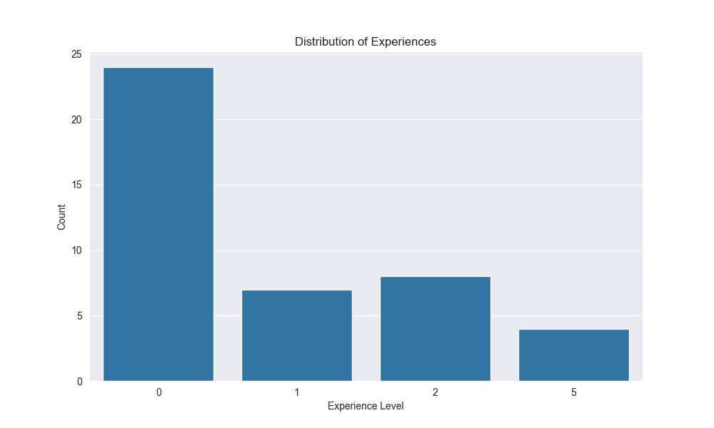
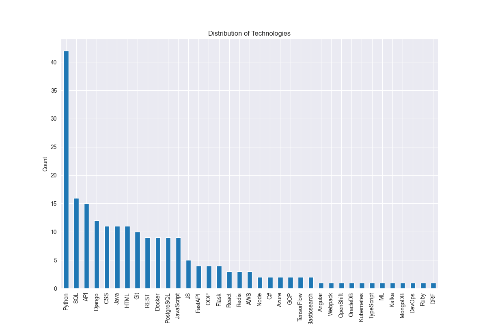
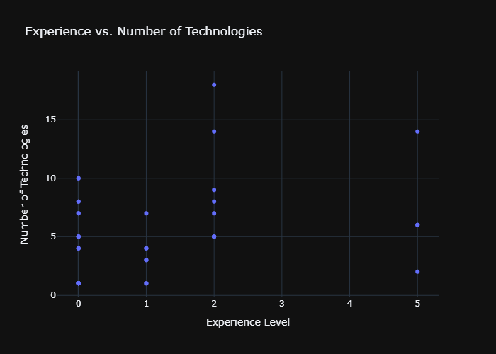

# Web Scraping and Data Analysis Project

This project involves web scraping IT job vacancies for Python from [Work.ua](https://www.work.ua/) and analyzing the data to gain insights into the distribution of experiences and technologies.

## Spider (Scrapy)

### Overview

The Scrapy spider (`vacancy`) crawls the [Work.ua](https://www.work.ua/) website, specifically the IT job vacancies related to Python. It extracts information about each job, including technologies mentioned and required experience.

### Usage

1. Make sure you have all dependencies are installed:

   ```bash
   pip install -r requirements.txt

2. Run the spider:

   ```bash
   scrapy crawl vacancy -o vacancies.csv
This will generate a CSV file (vacancies.csv) containing the scraped data.

## Data Analysis (Jupyter Notebook)
### Overview
The Jupyter Notebook (analyze_data.ipynb) reads the scraped data from the CSV file and performs data analysis using Pandas, Seaborn, Matplotlib, and Plotly.

### Usage
1. Install the required Python packages:

   ```bash
   pip install pandas seaborn matplotlib plotly
   
2. Open the Jupyter Notebook:

   ```bash
   jupyter notebook

Open the data_analys.ipynb notebook and execute the cells.

## Visualizations

- Experience Distribution:

- Technologies Distribution:

- Experience vs. Number of Technologies Scatter Plot:



